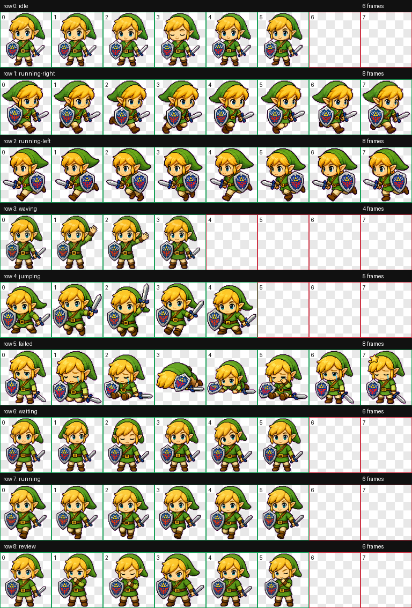
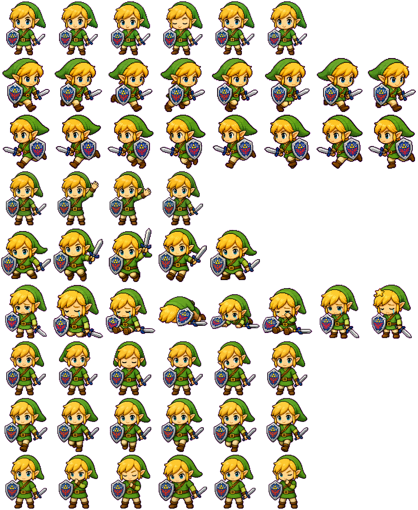

<div align="center">

# 🗡️ Link Pet for Codex

**A brave chibi Link companion for your Codex terminal**



[](LICENSE)
[](https://github.com/openai/codex)

[English](#english) | [中文](#中文)

</div>

---

<a id="english"></a>
## 🇬🇧 English

### Overview

A pixel-art Link (from The Legend of Zelda) pet sprite package for [OpenAI Codex](https://github.com/openai/codex). This chibi hero will accompany you during your coding adventures with 9 different animation states!

### ✨ Features

| Animation | Frames | Description |
|-----------|--------|-------------|
| `idle` | 6 | Standing still, breathing animation |
| `running` | 6 | Running forward |
| `running-right` | 8 | Running to the right |
| `running-left` | 8 | Running to the left |
| `waving` | 4 | Waving hello |
| `jumping` | 5 | Jumping up |
| `failed` | 8 | Defeated animation |
| `waiting` | 6 | Waiting patiently |
| `review` | 6 | Reviewing code |

### 📦 Package Contents

```
link-pet-open-source/
├── pet.json              # Pet manifest (id, name, description)
├── spritesheet.webp      # Final spritesheet (1536×1872, WEBP RGBA)
├── README.md             # This file
├── preview/
│   └── contact-sheet.png # Animation preview image
├── extras/
│   └── spritesheet.png   # PNG version for editing
└── meta/
    ├── validation.json   # Atlas validation result
    └── review.json       # Frame extraction QA result
```

### 🚀 Installation

1. **Download** this repository:
   ```bash
   git clone https://github.com/MonaJTX/Codex-pets-link.git
   ```

2. **Copy** the pet folder to your Codex pets directory:
   ```bash
   # Linux/macOS
   cp -r Codex-pets-link ~/.codex/pets/link/

   # Windows (PowerShell)
   Copy-Item -Recurse Codex-pets-link $env:USERPROFILE\.codex\pets\link\
   ```

3. **Enjoy!** Link will appear in your Codex terminal.

### 📐 Technical Specs

| Property | Value |
|----------|-------|
| Spritesheet Size | 1536 × 1872 px |
| Frame Size | 192 × 208 px |
| Format | WEBP (RGBA) |
| Grid Layout | 8 columns × 9 rows |
| Total Frames | 57 |
| Status | ✅ All QA checks passed |

### 📝 License

MIT License - Feel free to use and modify!

---

<a id="中文"></a>
## 🇨🇳 中文

### 概述

这是一个适用于 [OpenAI Codex](https://github.com/openai/codex) 的像素风格林克（来自《塞尔达传说》）宠物精灵包。这个Q版小英雄将在你的编程冒险中陪伴你，拥有 9 种不同的动画状态！

### ✨ 动画状态

| 动画 | 帧数 | 描述 |
|------|------|------|
| `idle` | 6 | 站立待机，呼吸动画 |
| `running` | 6 | 向前奔跑 |
| `running-right` | 8 | 向右跑 |
| `running-left` | 8 | 向左跑 |
| `waving` | 4 | 挥手打招呼 |
| `jumping` | 5 | 跳跃 |
| `failed` | 8 | 失败/被击败动画 |
| `waiting` | 6 | 耐心等待 |
| `review` | 6 | 代码审查 |

### 📦 包内容

```
link-pet-open-source/
├── pet.json              # 宠物清单（id、名称、描述）
├── spritesheet.webp      # 最终精灵图（1536×1872，WEBP RGBA）
├── README.md             # 本文件
├── preview/
│   └── contact-sheet.png # 动画预览图
├── extras/
│   └── spritesheet.png   # PNG版本，方便编辑
└── meta/
    ├── validation.json   # 图集验证结果
    └── review.json       # 帧提取QA结果
```

### 🚀 安装方法

1. **下载**本仓库：
   ```bash
   git clone https://github.com/MonaJTX/Codex-pets-link.git
   ```

2. **复制**宠物文件夹到 Codex 宠物目录：
   ```bash
   # Linux/macOS
   cp -r Codex-pets-link ~/.codex/pets/link/

   # Windows (PowerShell)
   Copy-Item -Recurse Codex-pets-link $env:USERPROFILE\.codex\pets\link\
   ```

3. **完成！** 林克将出现在你的 Codex 终端中。

### 📐 技术规格

| 属性 | 值 |
|------|-----|
| 精灵图尺寸 | 1536 × 1872 像素 |
| 单帧尺寸 | 192 × 208 像素 |
| 格式 | WEBP (RGBA) |
| 网格布局 | 8列 × 9行 |
| 总帧数 | 57 |
| 状态 | ✅ 所有QA检查通过 |

### 📝 许可证

MIT 许可证 - 欢迎使用和修改！

---

<div align="center">

### 🎮 Made with love for Codex

**Pet ID:** `link` | **Display Name:** 林克



⭐ If you like this pet, give it a star!

</div>
